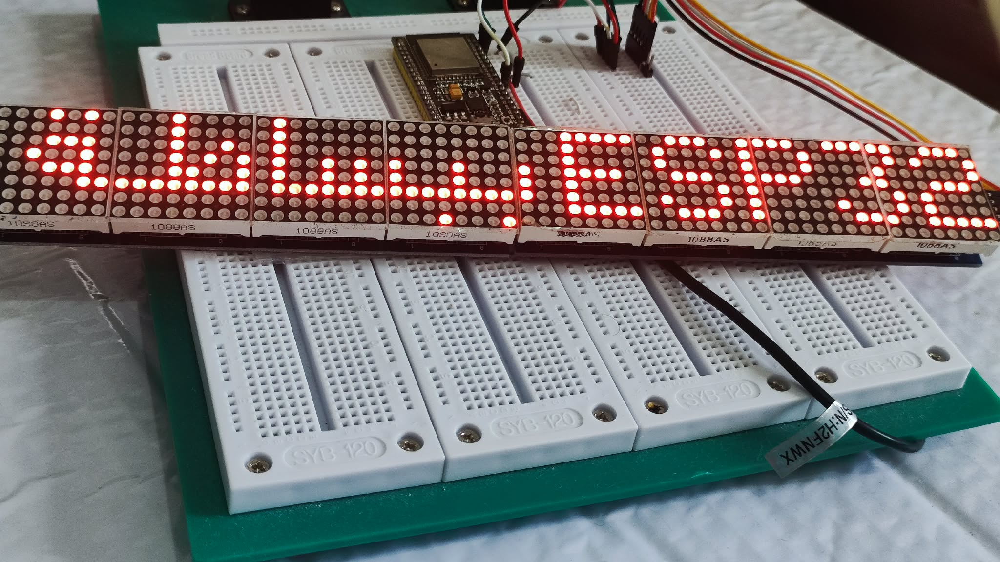
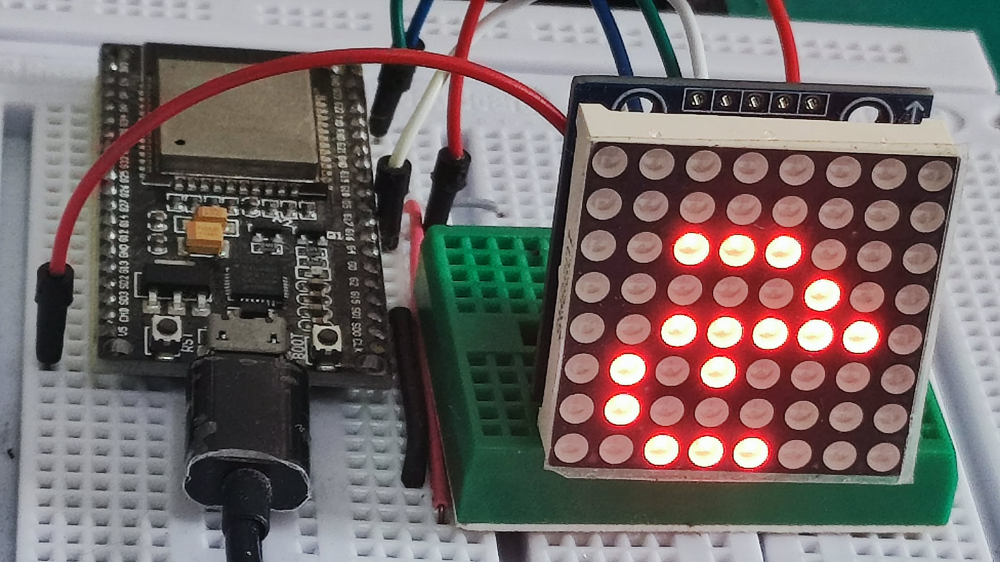
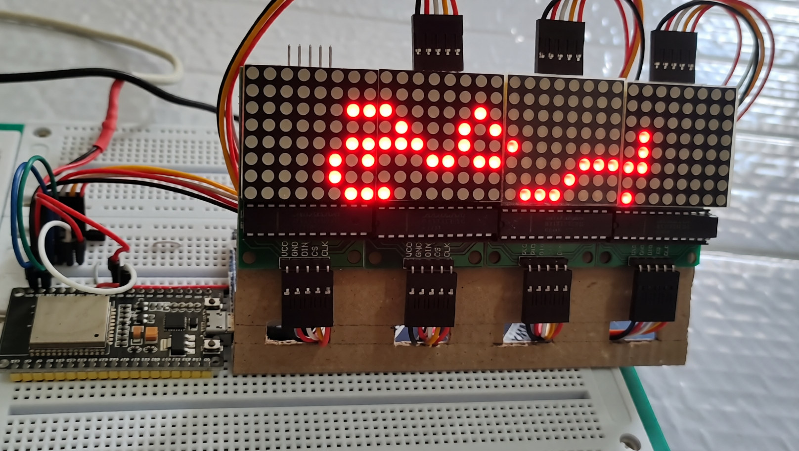
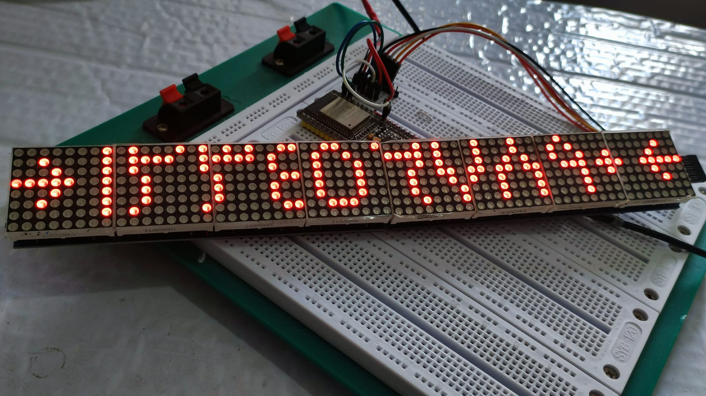

# LED Matrix Arabic MAX7219 for MicroBlocks

Arabic Unicode text display for MAX7219 8×8 LED matrices using MicroBlocks.

**Author:** ZLITNI Hsen  
**Version:** 1.2  
**License:** MIT

LED Matrix Arabic MAX7219 is a MicroBlocks library for displaying Arabic text on chained MAX7219 8×8 LED matrices.

It provides automatic contextual Arabic letter shaping, variable-width text, Arabic-Indic digits, mixed Arabic/ASCII messages, scrolling, text effects, blinking, Unicode icons, and support for GENERIC and FC16 matrix modules.

## Features

- Arabic Unicode text input with automatic contextual shaping
- 1 to 8 chained MAX7219 8×8 matrices
- GENERIC and FC16 matrix modules
- Variable-width Arabic and ASCII text
- Lam-Alif ligatures
- Tatweel support
- Arabic-Indic digits with preserved numerical order
- Right, Center and Left alignment
- Arabic, ASCII and Arabic-Indic text scrolling
- Auto, LTR and RTL scrolling directions
- Mixed Arabic, Arabic-Indic and non-Arabic groups
- Unicode icons using the native MicroBlocks font
- Dissolve, wipe, row wipe and curtain text effects
- Configurable text blinking
- Rotation, brightness and display power control

## Hardware Support

The library supports chains of **1 to 8 matrices**, providing displays from **8×8 up to 64×8 pixels**.

Hardware-tested configurations:

- **GENERIC:** 1 and 4 matrices
- **FC16:** 1, 4 and 8 matrices

Other configurations between 1 and 8 matrices are supported by the library architecture but have not all been physically tested.

### Hardware examples

| FC16 ×1 | GENERIC ×4 |
|---|---|
|  |  |

## Default ESP32 Wiring

The examples use an ESP32 with:

- **CLK = 18**
- **CS = 5**
- **DIN = 23**

Select the correct matrix type (`GENERIC` or `FC16`) and the number of chained devices for your hardware.

For multi-module configurations, use an appropriate **5 V power supply** for the LED matrices and ensure that the controller and matrix power supply share a **common ground**.

Detailed wiring diagrams are included in the Educational Examples Guide.

## Installation

1. Download [`LED-Matrix-Arabic-MAX7219-v1.2.ubl`](library/LED-Matrix-Arabic-MAX7219-v1.2.ubl).
2. Open MicroBlocks.
3. Import the library.
4. Connect your board.
5. Run `Arabic Matrix init` before using the display blocks.
6. Select the appropriate matrix type and number of devices.

## Quick Start

A basic program consists of:

1. `Arabic Matrix init`
2. Select CLK, CS and DIN.
3. Select `GENERIC` or `FC16`.
4. Select the number of matrices.
5. Optionally set rotation and brightness.
6. Use `Arabic Matrix show text`.

Arabic text can be entered directly in Unicode. The library automatically selects the appropriate contextual forms of supported Arabic letters.

For complete illustrated examples, see the:

**[Educational Examples Guide v1.2](docs/LED-Matrix-Arabic-MAX7219-Educational-Examples-v1.2.pdf)**

## Arabic Text

Arabic text is entered directly in Unicode and composed from right to left.

Contextual letter forms are handled automatically by the library.

Supported Arabic text features include:

- isolated, initial, medial and final letter forms
- Lam-Alif ligatures
- Tatweel (`ـ`)
- variable-width glyphs
- Arabic punctuation and symbols supported by the library

## Arabic-Indic Digits

The `Arabic digits` reporter converts ASCII digits:

`0123456789`

to:

`٠١٢٣٤٥٦٧٨٩`

while preserving numerical order.

For example:

`1234567890` → `١٢٣٤٥٦٧٨٩٠`

Arabic-Indic digits are handled independently from Arabic letter shaping and are composed in LTR numerical order.

## ASCII Text

ASCII and Latin characters use the native MicroBlocks font.

They are composed left-to-right and can be displayed independently or combined with Arabic text using Mixed groups.

## Mixed Text

`Arabic Matrix show mixed` combines Arabic and non-Arabic content on the same display.

Up to five independent groups can be used.

- Group 1 is the rightmost group.
- Group 5 is the leftmost group.
- Arabic groups use RTL composition.
- Non-Arabic groups use LTR composition.
- Empty groups are ignored.
- A blank separation is automatically inserted between non-empty groups.

Mixed groups can combine Arabic text, Arabic-Indic digits, ASCII text and Unicode icons.

## Alignment

Static text supports:

- Right
- Center
- Left

The selected alignment is also preserved by the supported text effects.

## Scrolling

`Arabic Matrix scroll text` supports:

- **Auto**
- **LTR**
- **RTL**

LTR and RTL describe the **physical movement of the composed text across the display**.

With `Auto`:

- Arabic text moves physically from left to right.
- ASCII text moves physically from right to left.
- Arabic-Indic digits move physically from right to left.

Arabic glyphs are never mirrored to change the scrolling direction.

The scrolling delay can be configured from **5 to 500 ms**.

## Mixed Scrolling

`Arabic Matrix scroll mixed` scrolls messages containing up to five independent Mixed groups while preserving the appropriate composition direction of each group.

It can combine Arabic text, Arabic-Indic digits, ASCII text and Unicode icons in the same scrolling message.

## Unicode Icons

The `Arabic icon` reporter provides Unicode symbols rendered using the native MicroBlocks font.

Available choices include arrows, a heart, geometric symbols, mathematical symbols, music symbols and currency symbols.

Icons can also be used as Mixed groups.

## Text Effects

`Arabic Matrix show text + effect` supports:

- dissolve
- wipe
- row wipe
- curtain

Effects can be used with Right, Center and Left alignment.

## Blink

`Arabic Matrix blink text` provides configurable:

- alignment
- ON duration
- OFF duration
- repetition count

ON and OFF durations can be configured independently.

## Educational Examples

Seven MicroBlocks example projects are included:

1. [Show Arabic Text](examples/01-show-arabic-text.ubp)
2. [Text Effects on Four GENERIC Matrices](examples/02-text-effects-generic-4.ubp)
3. [Show Mixed Text](examples/03-show-mixed-text.ubp)
4. [Blink Arabic Text](examples/04-blink-arabic-text.ubp)
5. [Arabic-Indic Digits](examples/05-arabic-indic-digits.ubp)
6. [Scroll Arabic Text](examples/06-scroll-arabic-text.ubp)
7. [Scroll Mixed Text](examples/07-scroll-mixed-text.ubp)

The complete illustrated guide, including wiring diagrams, MicroBlocks programs and real hardware results, is available here:

**[LED Matrix Arabic MAX7219 — Educational Examples Guide v1.2](docs/LED-Matrix-Arabic-MAX7219-Educational-Examples-v1.2.pdf)**

## Demo Videos

Real hardware demonstration videos are included:

- [Text Effects](videos/text-effects.mp4)
- [Blink Arabic Text](videos/blink-arabic-text.mp4)
- [Scroll Arabic Text](videos/scroll-arabic-text.mp4)
- [Scroll Mixed Text](videos/scroll-mixed-text.mp4)

The videos demonstrate functions whose behavior is easier to observe dynamically than in static photographs.

## Known Limitation

The library intentionally does not implement the complete Unicode Bidirectional Algorithm.

A multi-digit ASCII sequence entered directly inside an Arabic text group may therefore appear in reversed order.

For mixed Arabic and numerical content, use either:

- the `Arabic digits` reporter, or
- separate `Mixed` groups.

This avoids adding a complex Bidirectional Algorithm to the resource-constrained MicroBlocks implementation while providing explicit control over mixed-direction content.

## Font and Glyph Provenance

The display glyphs come from the following sources:

- **Arabic glyphs:** original designs by ZLITNI Hsen
- **Arabic-Indic digit glyphs:** original designs by ZLITNI Hsen
- **ASCII / Latin characters:** native MicroBlocks font via `shapeforChar`
- **Unicode icons:** native MicroBlocks font

## Documentation and Resources

- [Stable v1.2 library](library/LED-Matrix-Arabic-MAX7219-v1.2.ubl)
- [Educational Examples Guide](docs/LED-Matrix-Arabic-MAX7219-Educational-Examples-v1.2.pdf)
- [Example projects](examples/)
- [Hardware images](images/)
- [Demo videos](videos/)
- [Changelog](CHANGELOG.md)
- [License](LICENSE)

## Version

Current stable release: **v1.2**

Hardware-tested configurations:

- GENERIC ×1
- GENERIC ×4
- FC16 ×1
- FC16 ×4
- FC16 ×8

The library architecture supports chains of 1 to 8 matrices.

## License

This project is licensed under the **MIT License**.

See [LICENSE](LICENSE) for the complete license text.

Copyright (c) 2026 ZLITNI Hsen